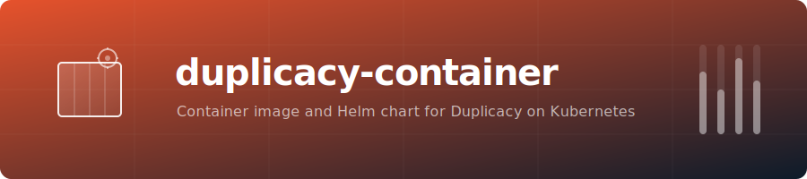

<p align="center">
  
</p>

# duplicacy-container

Container image and Helm chart repository for running a production-friendly Duplicacy stack on Kubernetes.

This repo now owns two related deliverables:

- the `drumsergio/duplicacy-container` runtime image for Kubernetes-native Duplicacy jobs
- the `duplicacy` Helm chart that packages the stack around it
- `duplicacy-exporter` for Prometheus metrics
- an optional Duplicacy Web UI pod, disabled by default and kept generic so you can choose the image and startup model you trust

## Why This Repo Exists

The Duplicacy Kubernetes story spans multiple sibling projects:

- `duplicacy-cli-cron` handles the backup execution model
- `duplicacy-exporter` turns backup activity into Prometheus metrics
- the chart glues them together into a reusable stack with PVCs, secrets, ingress, and monitoring

That stack is bigger than an exporter-only concern, so it lives better in its own repo.

## Included Components

- `Dockerfile` + `entrypoint.sh` - runtime image for one-shot or cron-style Duplicacy execution
- `charts/duplicacy` - Duplicacy stack chart with backup job, exporter, and optional Web UI

## Highlights

- A dedicated Duplicacy runtime image decoupled from the scripts-only repo
- One-shot Kubernetes-native backup scheduling instead of running a daemonized cron container
- Shared log PVC support for `duplicacy-exporter` log tail mode
- Optional webhook mode for Duplicacy Web UI
- Optional generic Web UI pod support on port `3875`
- `values.schema.json`, chart README, and Helm CI/release workflows
- Designed for real operators: existing secrets, existing PVCs, ServiceMonitor support, and escape hatches via `extraEnv`/`extraVolumes`

[](https://artifacthub.io/packages/helm/duplicacy/duplicacy)

## Quick Start

```bash
helm repo add duplicacy https://geiserx.github.io/duplicacy-container
helm install duplicacy duplicacy/duplicacy -f my-values.yaml
```

See the [chart documentation](charts/duplicacy/README.md) for the full values reference and examples.

## Web UI Support

The Web UI component is intentionally:

- `disabled` by default
- generic rather than hardcoded to one wrapper image
- configured through `web.image.*`, `web.command`, `web.args`, and optional ingress/PVC settings

This keeps the chart useful without baking in a deployment choice that may not fit every operator or licensing situation.

## Runtime Image

The bundled image is intentionally minimal:

- it ships Duplicacy CLI plus `shoutrrr`
- it keeps the familiar periodic directory layout
- it expects operators to mount their own `/config` and `/etc/periodic/*` content

That lets `duplicacy-cli-cron` stay focused on reusable scripts and backup recipes while this repo owns the runtime/container distribution.

## Ecosystem

| Project | Type | Description |
|---------|------|-------------|
| [duplicacy-cli-cron](https://github.com/GeiserX/duplicacy-cli-cron) | Docker | Docker-based CLI backup automation with cron and Telegram notifications |
| [duplicacy-exporter](https://github.com/GeiserX/duplicacy-exporter) | Prometheus | Prometheus exporter for real-time backup metrics |
| [duplicacy-ha](https://github.com/GeiserX/duplicacy-ha) | Home Assistant | Home Assistant integration for backup monitoring |
| [duplicacy-mcp](https://github.com/GeiserX/duplicacy-mcp) | MCP | MCP server for monitoring backups from AI assistants |

See also [Duplicacy](https://duplicacy.com) — the lock-free deduplication backup tool this ecosystem is built around.

## License

`duplicacy-container` is licensed under `GPL-3.0-or-later`.
